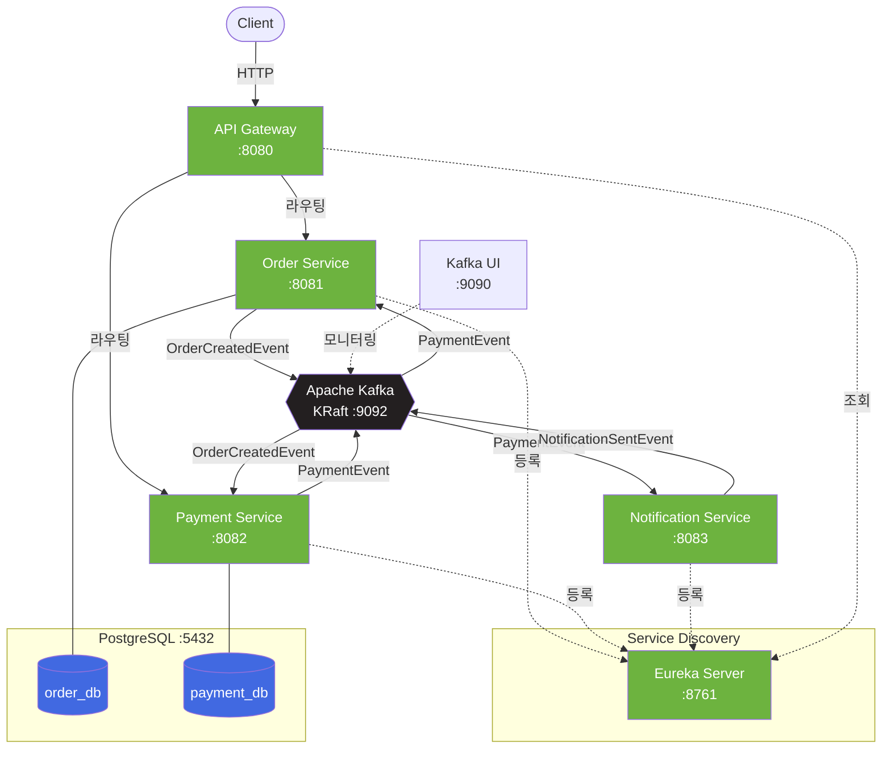
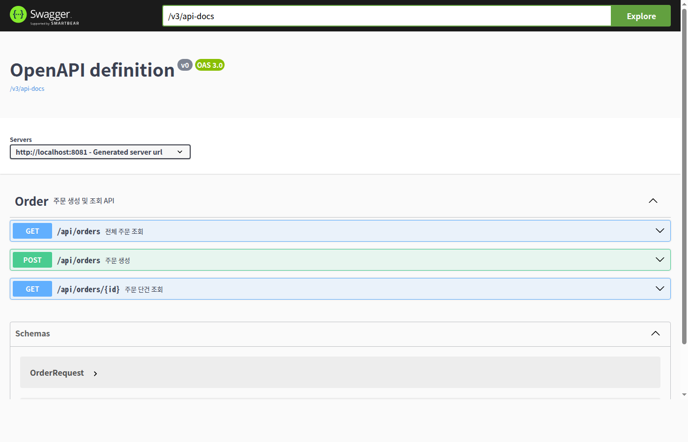
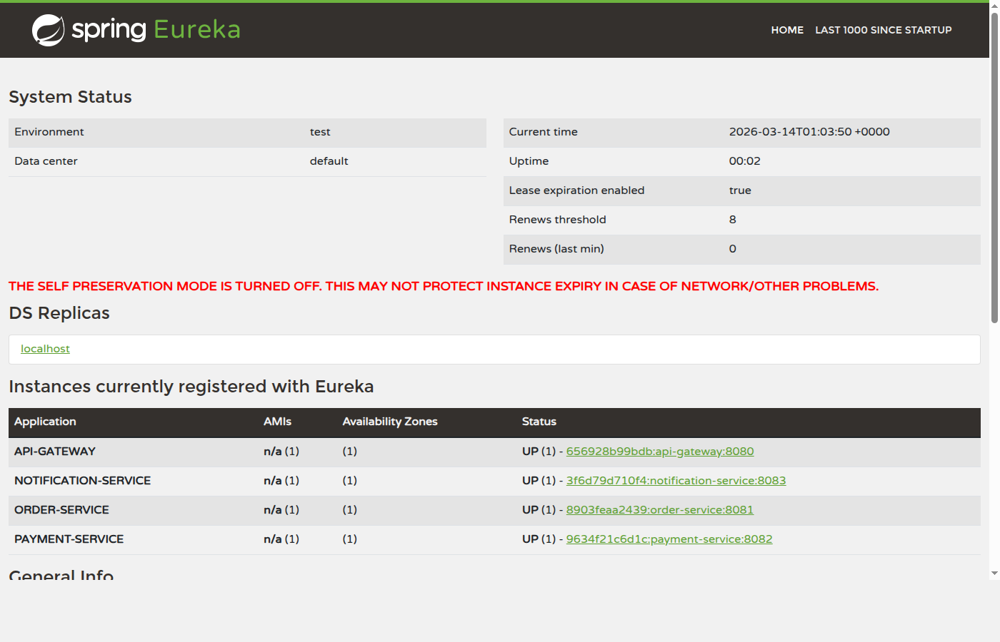
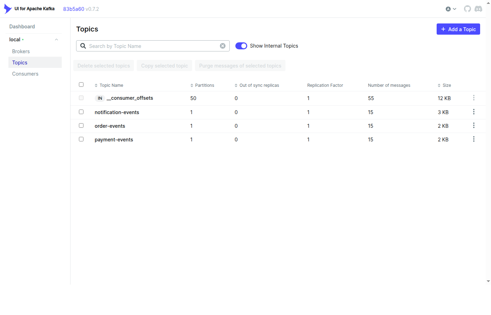
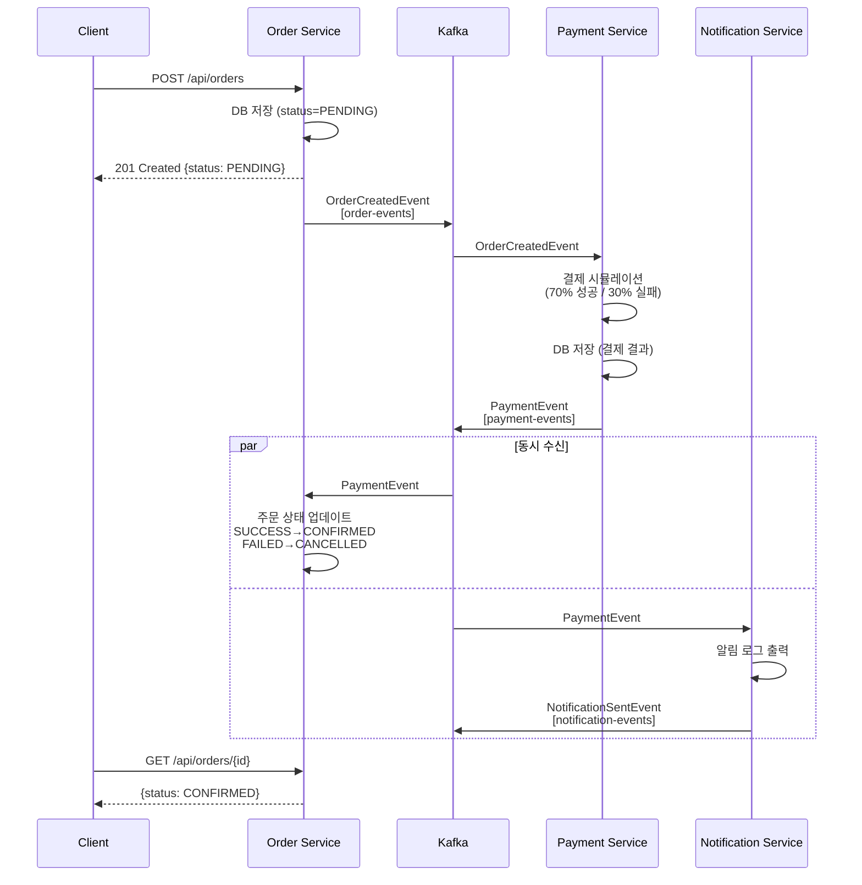

# Spring Cloud + Kafka 예제 프로젝트

> **"결제 서비스가 죽으면 주문도 못 받는다고?"** — 동기 호출의 한계를 느끼고, 비동기 이벤트 기반 아키텍처로 전환한 과정을 담은 프로젝트.


Spring Cloud 마이크로서비스 환경에서 Apache Kafka를 활용한 이벤트 기반 아키텍처(EDA) 학습용 프로젝트.
**온라인 주문 시스템**을 도메인으로, 주문 → 결제 → 알림의 비동기 이벤트 흐름을 구현한다.

모든 인프라와 서비스는 Docker 컨테이너로 실행되며, 로컬에 Java/Gradle 설치 없이 동작한다.

---

## 왜 이 프로젝트를 만들었는가

마이크로서비스에서 서비스 간 **동기 HTTP 호출**은 간단하지만 치명적인 문제가 있다:

```
[ 동기 호출의 문제 ]

Client → Order Service →→→ Payment Service (장애!)
                        ↑
                        └── Order Service도 함께 실패
                            = 연쇄 장애 (Cascading Failure)
```

- Payment Service가 죽으면 **Order Service도 응답 불가** (강한 결합)
- 결제가 느리면 **주문 API 전체가 느려짐** (시간적 결합)
- 알림 서비스 추가 시 **Order → Payment → Notification 순차 호출** 필요 (확장 어려움)

이 프로젝트는 **Kafka 기반 비동기 이벤트**로 이 문제를 해결하는 과정을 담았다:

```
[ 비동기 이벤트로 전환 ]

Client → Order Service → Kafka ──▶ Payment Service (독립 처리)
                                ──▶ Notification Service (독립 처리)

Payment Service가 죽어도?
→ Order Service는 정상 동작
→ Kafka가 메시지를 보관
→ Payment Service 복구 시 밀린 주문 자동 처리
```

**직접 경험한 문제 → 해결 과정 → 동작하는 코드**를 이 프로젝트에서 확인할 수 있다.

---

## 아키텍처



---

## 스크린샷

### Swagger UI — API 문서 자동 생성
> `http://localhost:8081/swagger-ui/index.html`



### Eureka Dashboard — 서비스 등록 현황
> `http://localhost:8761`



### Kafka UI — 토픽 및 메시지 모니터링
> `http://localhost:9090`



---

## 컨테이너 구성

| 컨테이너 | 이미지 | 포트 | 역할 |
|----------|--------|------|------|
| `eureka-server` | 자체 빌드 (Spring Boot) | 8761 | 서비스 디스커버리. 모든 마이크로서비스가 여기에 등록되고, Gateway가 여기서 서비스 위치를 조회한다. |
| `api-gateway` | 자체 빌드 (Spring Cloud Gateway) | 8080 | 클라이언트의 단일 진입점. `/api/orders/**` → order-service, `/api/payments/**` → payment-service로 라우팅한다. |
| `order-service` | 자체 빌드 (Spring Boot) | 8081 | 주문 CRUD 및 Kafka 이벤트 발행/수신. |
| `payment-service` | 자체 빌드 (Spring Boot) | 8082 | 결제 처리 시뮬레이션 및 Kafka 이벤트 발행/수신. |
| `notification-service` | 자체 빌드 (Spring Boot) | 8083 | 결제 결과 알림을 로그로 출력. |
| `kafka` | apache/kafka:3.7.0 | 9092 | 메시지 브로커. KRaft 모드로 Zookeeper 없이 단독 실행. |
| `postgresql` | postgres:16-alpine | 5432 | 관계형 데이터베이스. order_db와 payment_db 두 개의 데이터베이스를 생성한다. |
| `kafka-ui` | provectuslabs/kafka-ui | 9090 | 웹 기반 Kafka 모니터링 도구. 토픽, 메시지, 컨슈머 그룹을 시각적으로 확인할 수 있다. |

---

## 기술 스택

- **Java 17** + **Spring Boot 3.2.5**
- **Spring Cloud 2023.0.1**
  - Spring Cloud Gateway — 리액티브 API 게이트웨이
  - Spring Cloud Netflix Eureka — 서비스 디스커버리
- **Spring for Apache Kafka** — Kafka Producer/Consumer
- **Spring Data JPA** — ORM 기반 DB 접근
- **PostgreSQL 16** — RDBMS
- **Apache Kafka 3.7 (KRaft)** — 이벤트 스트리밍 플랫폼
- **Gradle 8.7** — 빌드 도구 (Docker 멀티스테이지 빌드 내에서 실행)
- **Docker & Docker Compose** — 컨테이너 오케스트레이션

---

## Kafka 이벤트 흐름

### 토픽

| 토픽명 | Producer | Consumer | 설명 |
|--------|----------|----------|------|
| `order-events` | order-service | payment-service | 주문 생성 이벤트 |
| `payment-events` | payment-service | order-service, notification-service | 결제 완료/실패 이벤트 |
| `notification-events` | notification-service | — | 알림 발송 이벤트 (로깅용) |

### 이벤트 플로우 상세



### Consumer Group 설계

각 서비스는 고유한 Consumer Group ID를 사용한다:

- `order-service-group` — payment-events 토픽의 결제 결과를 수신하여 주문 상태를 업데이트
- `payment-service-group` — order-events 토픽의 주문 생성 이벤트를 수신하여 결제 처리
- `notification-service-group` — payment-events 토픽의 결제 결과를 수신하여 알림 발송

**핵심**: `payment-events` 토픽을 order-service와 notification-service가 **서로 다른 Consumer Group**으로 구독하므로, 두 서비스 모두 동일한 메시지를 각각 수신한다. 이것이 Kafka의 pub/sub 모델이다.

### Type Mapping (크로스 서비스 역직렬화)

각 서비스는 독립된 패키지 구조를 가지므로, Kafka의 `__TypeId__` 헤더에 담긴 클래스명이 consumer 측에서 달라질 수 있다. 이를 해결하기 위해 `spring.json.type.mapping` 설정을 사용한다:

```
# Producer (order-service)
spring.json.type.mapping=orderCreated:com.example.order.event.OrderCreatedEvent

# Consumer (payment-service) — 같은 논리적 타입명으로 자기 패키지의 클래스에 매핑
spring.json.type.mapping=orderCreated:com.example.payment.event.OrderCreatedEvent
```

---

## DB 설계

### order_db.orders

| 컬럼 | 타입 | 설명 |
|------|------|------|
| id | BIGSERIAL (PK) | 주문 ID (자동 생성) |
| product_name | VARCHAR(255) | 상품명 |
| quantity | INT | 수량 |
| price | DECIMAL(10,2) | 단가 |
| status | VARCHAR(20) | 주문 상태: PENDING, CONFIRMED, CANCELLED |
| created_at | TIMESTAMP | 생성 시각 |

### payment_db.payments

| 컬럼 | 타입 | 설명 |
|------|------|------|
| id | BIGSERIAL (PK) | 결제 ID (자동 생성) |
| order_id | BIGINT | 주문 ID (외래키 개념) |
| amount | DECIMAL(10,2) | 결제 금액 (단가 × 수량) |
| status | VARCHAR(20) | 결제 상태: SUCCESS, FAILED |
| created_at | TIMESTAMP | 생성 시각 |

> 테이블은 Spring JPA `ddl-auto: update` 설정에 의해 서비스 기동 시 자동 생성된다.

---

## API 엔드포인트

모든 요청은 API Gateway (`:8080`)를 통해 라우팅된다.

### 주문 API

#### 주문 생성

```bash
POST /api/orders
Content-Type: application/json

{
  "productName": "맥북 프로",
  "quantity": 1,
  "price": 2500000
}
```

**응답** (201 Created):
```json
{
  "id": 1,
  "productName": "맥북 프로",
  "quantity": 1,
  "price": 2500000,
  "status": "PENDING",
  "createdAt": "2026-03-08T03:26:31.554024"
}
```

> 주문 생성 직후에는 `PENDING` 상태이다. Kafka를 통해 결제가 처리되면 비동기적으로 `CONFIRMED` 또는 `CANCELLED`로 변경된다.

#### 주문 조회

```bash
GET /api/orders/{id}
```

**응답**:
```json
{
  "id": 1,
  "productName": "맥북 프로",
  "quantity": 1,
  "price": 2500000.00,
  "status": "CONFIRMED",
  "createdAt": "2026-03-08T03:26:31.554024"
}
```

#### 전체 주문 목록

```bash
GET /api/orders
```

### 결제 API

#### 주문별 결제 조회

```bash
GET /api/payments/order/{orderId}
```

**응답**:
```json
{
  "id": 1,
  "orderId": 1,
  "amount": 2500000.00,
  "status": "SUCCESS",
  "createdAt": "2026-03-08T03:26:31.600000"
}
```

---

## 사용법

### 사전 요구사항

- Docker (20.10+)
- Docker Compose (v2+)

### 전체 기동

```bash
cd spring-kafka-example

# 빌드 및 기동 (첫 실행 시 빌드에 수 분 소요)
docker compose up -d --build

# 컨테이너 상태 확인
docker compose ps
```

기동 순서는 `depends_on` + `healthcheck`로 자동 제어된다:
1. PostgreSQL, Kafka → (healthy 확인)
2. Eureka Server → (healthy 확인)
3. Order/Payment/Notification Service → (Eureka 등록)
4. API Gateway → (Eureka에서 서비스 조회)

> Eureka 등록에 약 30초 정도 소요될 수 있다. Gateway를 통한 요청이 503을 반환하면 잠시 기다린 후 재시도한다.

> ⚠️ **주의**: `docker-compose.yml`에 포함된 PostgreSQL 자격 증명(`postgres/postgres`)은 **로컬 개발 전용**이다. 프로덕션 환경에서는 반드시 안전한 비밀번호를 사용하고, 환경 변수나 시크릿 관리 도구를 통해 주입해야 한다.

### 테스트 시나리오

```bash
# 1. 주문 생성
curl -X POST http://localhost:8080/api/orders \
  -H "Content-Type: application/json" \
  -d '{"productName":"맥북 프로","quantity":1,"price":2500000}'

# 2. 2~3초 후 주문 상태 확인 (PENDING → CONFIRMED 또는 CANCELLED)
curl http://localhost:8080/api/orders/1

# 3. 결제 정보 확인
curl http://localhost:8080/api/payments/order/1

# 4. 여러 주문을 생성해서 성공/실패 비율 확인 (70% 성공, 30% 실패)
for i in $(seq 1 10); do
  curl -s -X POST http://localhost:8080/api/orders \
    -H "Content-Type: application/json" \
    -d "{\"productName\":\"상품$i\",\"quantity\":1,\"price\":10000}" &
done
wait
sleep 3
curl -s http://localhost:8080/api/orders | python3 -m json.tool

# 5. 전체 주문 목록 조회
curl http://localhost:8080/api/orders
```

### 모니터링

| URL | 설명 |
|-----|------|
| http://localhost:8080/webjars/swagger-ui/index.html | Swagger UI (Gateway 통합) — 모든 서비스 API 테스트 |
| http://localhost:8761 | Eureka 대시보드 — 등록된 서비스 인스턴스 확인 |
| http://localhost:9090 | Kafka UI — 토픽, 메시지, 컨슈머 그룹 모니터링 |

### 로그 확인

```bash
# 전체 서비스 로그 (실시간)
docker compose logs -f

# 특정 서비스 로그
docker compose logs -f order-service
docker compose logs -f payment-service
docker compose logs -f notification-service

# Notification 서비스에서 알림 메시지 확인
docker compose logs notification-service | grep "SENDING NOTIFICATION"
```

### 종료 및 정리

```bash
# 컨테이너 중지
docker compose down

# 컨테이너 + 볼륨(DB 데이터) 삭제
docker compose down -v

# 빌드된 이미지까지 삭제
docker compose down -v --rmi all
```

---

## 프로젝트 구조

```
spring-kafka-example/
├── docker-compose.yml          # 전체 인프라 + 서비스 오케스트레이션
├── init-db.sql                 # PostgreSQL 초기화 (order_db, payment_db 생성)
├── build.gradle                # 루트 빌드 (멀티모듈 공통 설정)
├── settings.gradle             # Gradle 멀티모듈 설정
│
├── eureka-server/
│   ├── Dockerfile
│   ├── build.gradle
│   └── src/main/
│       ├── java/com/example/eureka/
│       │   └── EurekaServerApplication.java
│       └── resources/
│           └── application.yml
│
├── api-gateway/
│   ├── Dockerfile
│   ├── build.gradle
│   └── src/main/
│       ├── java/com/example/gateway/
│       │   └── ApiGatewayApplication.java
│       └── resources/
│           └── application.yml          # 라우팅 규칙 정의
│
├── order-service/
│   ├── Dockerfile
│   ├── build.gradle
│   └── src/main/
│       ├── java/com/example/order/
│       │   ├── OrderServiceApplication.java
│       │   ├── controller/
│       │   │   └── OrderController.java     # REST API
│       │   ├── dto/
│       │   │   └── OrderRequest.java        # 요청 DTO
│       │   ├── entity/
│       │   │   ├── Order.java               # JPA 엔티티
│       │   │   └── OrderStatus.java         # PENDING/CONFIRMED/CANCELLED
│       │   ├── event/
│       │   │   ├── OrderCreatedEvent.java   # Kafka 발행 이벤트
│       │   │   └── PaymentEvent.java        # Kafka 수신 이벤트
│       │   ├── repository/
│       │   │   └── OrderRepository.java     # Spring Data JPA
│       │   └── service/
│       │       ├── OrderService.java        # 비즈니스 로직 + Kafka Producer
│       │       └── PaymentEventConsumer.java # Kafka Consumer
│       └── resources/
│           └── application.yml
│
├── payment-service/
│   ├── Dockerfile
│   ├── build.gradle
│   └── src/main/
│       ├── java/com/example/payment/
│       │   ├── PaymentServiceApplication.java
│       │   ├── controller/
│       │   │   └── PaymentController.java
│       │   ├── entity/
│       │   │   ├── Payment.java
│       │   │   └── PaymentStatus.java       # SUCCESS/FAILED
│       │   ├── event/
│       │   │   ├── OrderCreatedEvent.java   # Kafka 수신 이벤트
│       │   │   └── PaymentEvent.java        # Kafka 발행 이벤트
│       │   ├── repository/
│       │   │   └── PaymentRepository.java
│       │   └── service/
│       │       └── PaymentService.java      # 결제 시뮬레이션 + Kafka Producer/Consumer
│       └── resources/
│           └── application.yml
│
└── notification-service/
    ├── Dockerfile
    ├── build.gradle
    └── src/main/
        ├── java/com/example/notification/
        │   ├── NotificationServiceApplication.java
        │   ├── event/
        │   │   ├── PaymentEvent.java            # Kafka 수신 이벤트
        │   │   └── NotificationSentEvent.java   # Kafka 발행 이벤트
        │   └── service/
        │       └── NotificationConsumer.java    # Kafka Consumer + 알림 로직
        └── resources/
            └── application.yml
```

---

## 이 프로젝트에서 배울 수 있는 것

| 주제 | 해결한 문제 | 적용 기술 |
|------|-------------|-----------|
| **비동기 이벤트 통신** | 동기 호출의 연쇄 장애, 시간적 결합 | Kafka Producer/Consumer, `KafkaTemplate`, `@KafkaListener` |
| **Consumer Group** | 같은 이벤트를 여러 서비스가 독립 소비 | `payment-events`를 order-service, notification-service가 각각 구독 |
| **크로스 서비스 타입 매핑** | 서비스마다 다른 패키지의 이벤트 클래스 역직렬화 | `spring.json.type.mapping`으로 논리적 alias 사용 |
| **서비스 디스커버리** | 서비스 위치(IP/포트) 하드코딩 제거 | Eureka 자동 등록 + Gateway `lb://` 라우팅 |
| **장애 복구** | 서비스 다운 시 메시지 유실 방지 | Kafka 메시지 보존 → 복구 후 자동 소비 |
| **컨테이너 오케스트레이션** | 8개 컨테이너 기동 순서 관리 | `depends_on` + `healthcheck` + 멀티스테이지 빌드 |

> 상세 학습은 [docs/](docs/README.md)의 11개 기술 문서를 참고.
